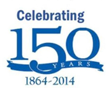
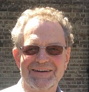

Masses are taking place however fewer masses than normal will be celebrated and strict [social distancing](socialdistancing.htm) guidelines wil apply. See [here](masstimes.htm) for times and details.

#### Normal masses have resumed. Please note that times are slightly different to those prior to the pandemic. See [here](../pages/masstimes.htm?refresh=y) for times and details. This information is current as of 2nd October 2022.

  
[A message from Fr Chris](../documents/frchris/Annce%2010%20July%202020.pdf)  
click [here](../pages/newsletters.htm) to view previous messages

On Saturday, 10th October 2020, Carlo Acutis was beatified by Pope Francis. [Read more](../pages/news.htm) 

[A Letter from His Holiness Pope Francis](../documents/letter%20from%20pope%20francis%20may%2020.pdf)

[A Letter from Cardinal Vincent Nichols regarding the easing of lockdown restrictions](../documents/CardinalVNicholsLetter25Jun2020.pdf)